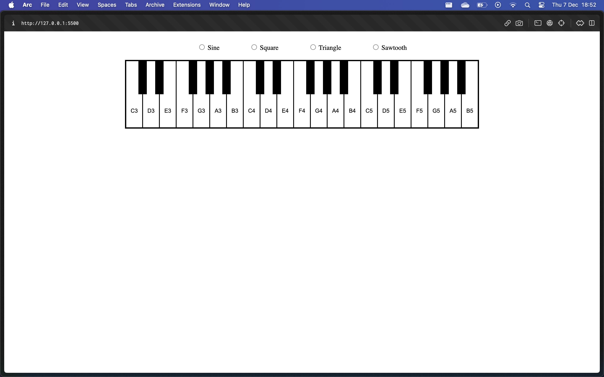

# PianoJS
PianoJS is an engaging and versatile piano project crafted using JavaScript. Leveraging the Audio Context Web API, it allows users to explore the world of music by generating rich and dynamic sounds directly in the browser.

## Technologies Used:
HTML, CSS, JavaScript

## Latest Screenshot

